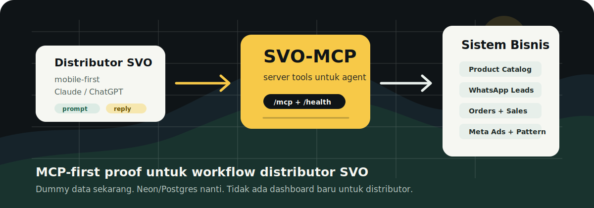
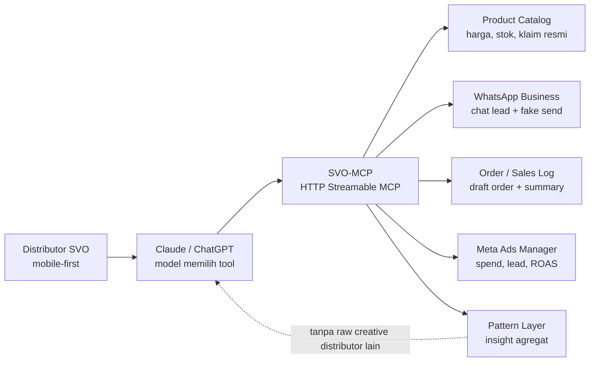
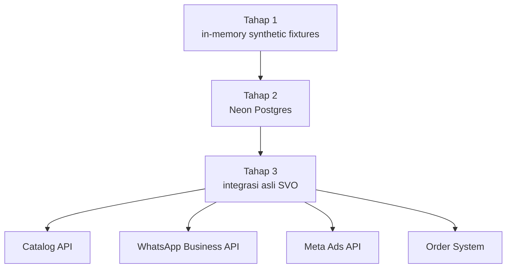

<p align="center">
  
</p>

# SVO-MCP

**SVO-MCP** adalah server MCP untuk assessment SVO x BelajarGPT. Tujuannya membuktikan bahwa Claude, ChatGPT, atau host MCP lain bisa memanggil sistem bisnis SVO lewat tool contract yang jelas, aman, dan bisa dites.

Tahap 1 sengaja dibuat **MCP API only**. Belum ada dashboard distributor, belum ada widget ChatGPT, dan belum ada koneksi ke API asli. Fokusnya adalah membuktikan arsitektur, guardrail, dan flow agent memakai data synthetic yang realistis.

## Gambaran Arsitektur



Endpoint runtime:

| Endpoint | Fungsi |
| --- | --- |
| `GET /` | Status singkat untuk deploy checker Fly.io |
| `GET /health` | Health check lokal dan Fly.io |
| `POST /mcp` | Endpoint MCP Streamable HTTP |

## Tools Yang Tersedia

| Tool | Tipe | Fungsi |
| --- | --- | --- |
| `catalog_lookup_product` | Read | Lookup produk, harga, stok, approved claims, forbidden claims |
| `whatsapp_get_recent_messages` | Read | Ambil chat lead/customer milik distributor tertentu |
| `whatsapp_draft_reply` | Read | Draft balasan Bahasa Indonesia dengan guardrail klaim |
| `whatsapp_send_message` | Fake write | Simulasi kirim WhatsApp ke dummy store |
| `orders_create_draft_order` | Fake write | Buat draft order synthetic |
| `orders_get_sales_log` | Read | Ringkasan order dan revenue distributor |
| `ads_get_performance_summary` | Read | Ringkasan performa Meta Ads synthetic |
| `patterns_get_network_insights` | Read | Insight agregat tanpa membuka data mentah distributor lain |

## Strategi Data

Saat ini data **bukan dari gambar, bukan dari API asli, dan belum SQL**. Tahap 1 memakai fixture TypeScript yang di-seed ke in-memory store.

Kenapa belum langsung Neon/Postgres?

- Tool contract MCP harus stabil dulu.
- Test jadi deterministik dan cepat.
- Tidak perlu setup database untuk membuktikan flow.
- Tidak ada risiko kebocoran data real customer/distributor.

Tapi untuk production setelah demo valid, pilihan yang paling masuk akal adalah **Postgres**, dan **Neon** cocok karena managed, ringan, dan gampang dipasangkan dengan Fly.io.



Skema Neon yang nanti masuk akal:

| Tabel | Alasan |
| --- | --- |
| `distributors` | batas tenant dan ownership data |
| `products` | katalog resmi dan guardrail klaim |
| `customers` | lead/customer milik distributor |
| `whatsapp_messages` | konteks percakapan dan kualitas closing |
| `orders` / `order_items` | draft order dan sales log |
| `ad_campaigns` | data performa Meta Ads |
| `network_patterns` | insight agregat yang aman dibagikan |
| `tool_audit_logs` | audit trail, latency, idempotency |

Bottom line data: **fixtures sekarang, Neon/Postgres setelah MCP flow terbukti**.

## Menjalankan Lokal

```bash
npm install
npm run build
npm start
```

URL lokal:

- Health: `http://127.0.0.1:8080/health`
- MCP: `http://127.0.0.1:8080/mcp`

Mode development:

```bash
npm run dev
```

## Testing

```bash
npm test
```

Test suite mencakup:

- product lookup
- forbidden claim detection
- isolasi data antar distributor
- fake write yang idempotent
- health endpoint
- MCP client list/call flow
- flow lead response: messages -> catalog -> draft reply -> fake send

## Deploy Ke Fly.io

Project ini sudah punya `Dockerfile` dan `fly.toml`.

```bash
fly deploy
```

Setelah deploy, endpoint MCP akan berbentuk:

```text
https://nama-app.fly.dev/mcp
```

## Media Testing

Urutan testing yang paling aman:

1. `npm test` untuk automated test lokal.
2. MCP Inspector untuk panggil tools secara manual.
3. ChatGPT Apps / connector developer mode jika akun mendukung custom MCP endpoint.

Contoh prompt untuk host MCP:

```text
Pakai SVO-MCP. Ambil chat terbaru dist-ayu dengan cust-rina, cek produk Glow Serum, lalu draft balasan WhatsApp yang aman dari klaim berlebihan.
```

Expected tool flow:

```text
whatsapp_get_recent_messages -> catalog_lookup_product -> whatsapp_draft_reply
```

## Kenapa Ini Relevan Untuk PRD SVO

SVO tidak meminta model training atau dashboard baru. Yang diminta adalah connective infrastructure: MCP servers, Claude skills, dan agents yang menghubungkan LLM ke sistem bisnis. SVO-MCP membuktikan hal itu secara konkret:

- Claude/ChatGPT tetap jadi surface kerja distributor.
- WhatsApp tetap jadi tempat closing.
- Catalog, orders, ads, dan pattern layer bisa dipanggil sebagai tools.
- Insight jaringan bisa dibagikan sebagai agregat tanpa membocorkan raw creative atau customer data distributor lain.

---

**SVO Assessment by Yoel**
